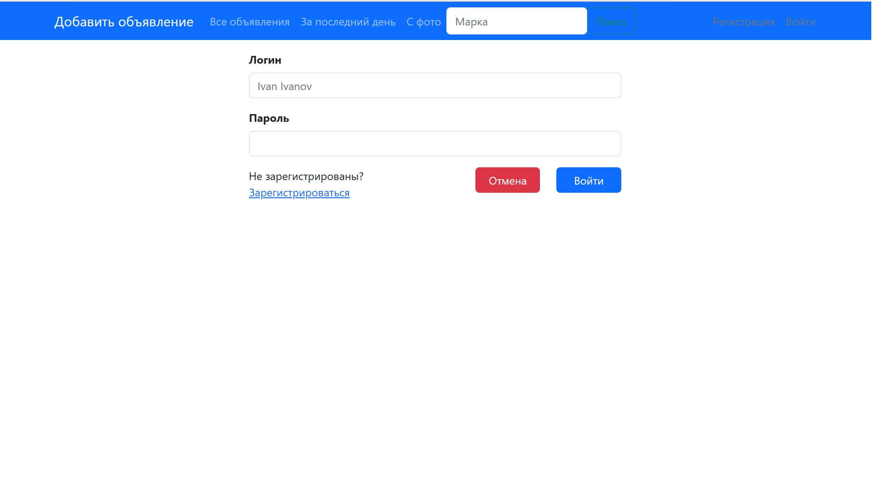
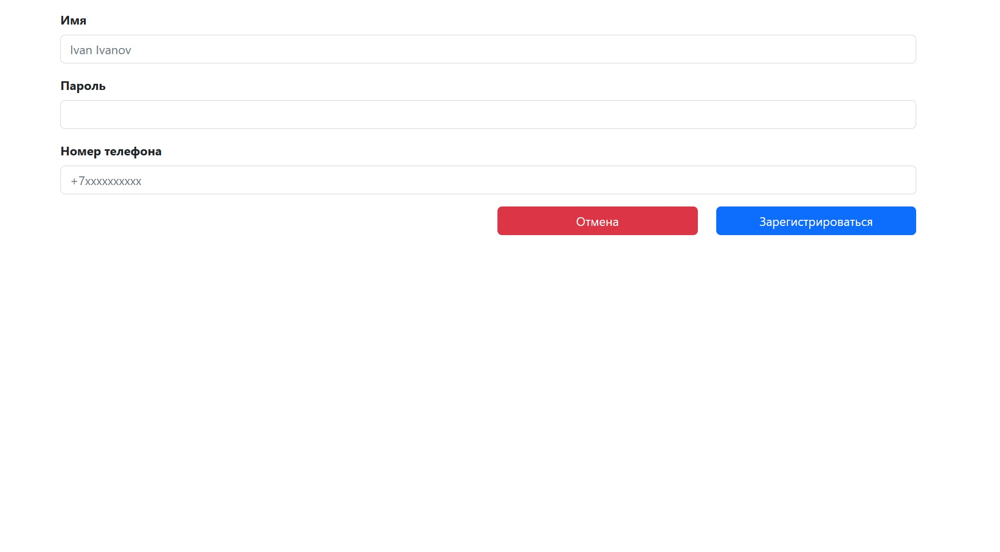
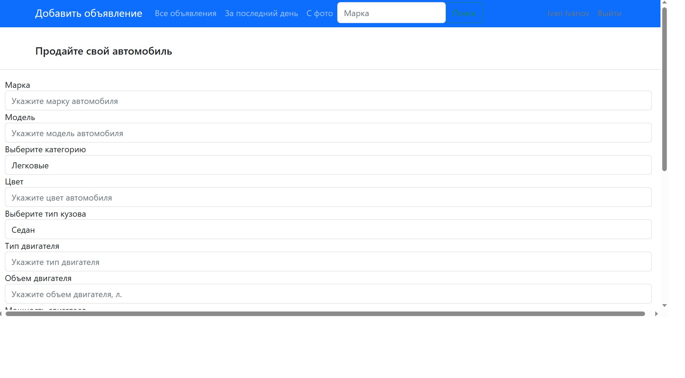
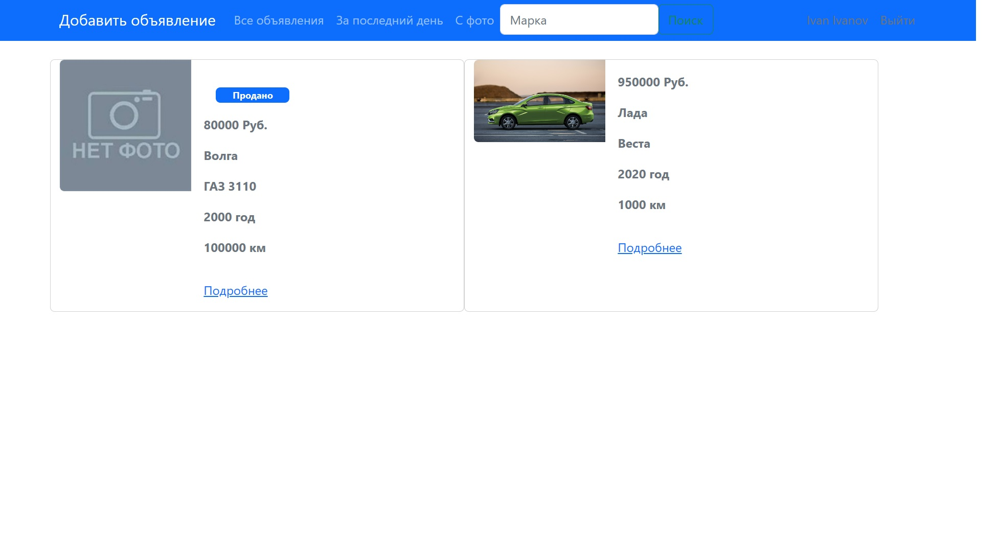
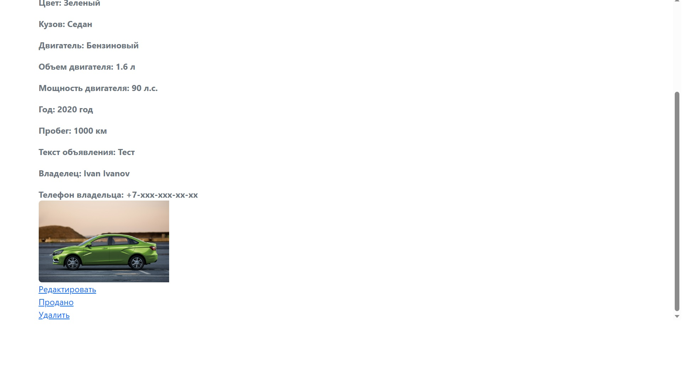
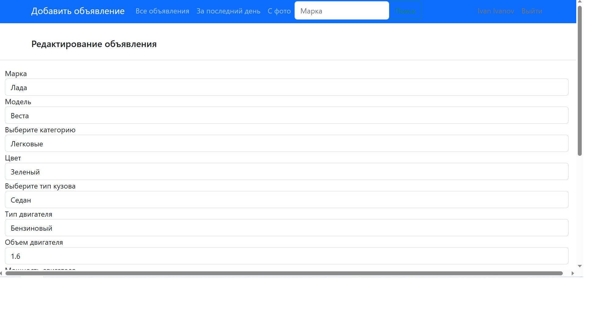

### Название проекта:
***job4j_cars***;
___
### Описание проекта:
проект представляет из себя web приложение для продажи машин.
Техническое задание:
1. Основная страница. таблица со всеми объявлениям машин на продажу.
2. На странице должна быть кнопка добавить новое объявление.
3. Переходить на страницу добавления.
4. Должны быть категории машины, марка, тип кузова и тд. Пример с сайта auto.ru.
5. Можно добавлять фото.
6. Объявление имеет статус продано или нет.
7. Должны существовать пользователи. Кто подал заявление - только он может менять статус.
___
### Стек технологий:
+ Spring Boot 5,
+ Thymeleaf 3.0,
+ Bootstrap 5,
+ Liquibase 4.15.0,
+ PostgreSQL 14,
+ Hibernate 5.6.11.Final;
___
### Требования к окружению:
+ Java 17,
+ Maven 3.8,
+ PostgreSQL 14;
___
### Взаимодействие с приложением:
***Основные виды приложения:***
+ *Страница аутентификации*
  
+ *Страница регистрации*
  
+ *Страница добавления объявления*
  
+ *Страница со всеми объявлениями, статусом продано, фильтрами объявлений (за последний день, с фото, по марке автомобиля*
  
+ *Страница просмотра деталей объявления*
  
+ *Страница редактирования объявления*
    
### Запуск проекта:
+ Создать базу данных командой ```create database cars```;
+ Запустить проект командой ```mvn spring-boot:run```;
___
### Контакты:
Телеграм: @semi999rus